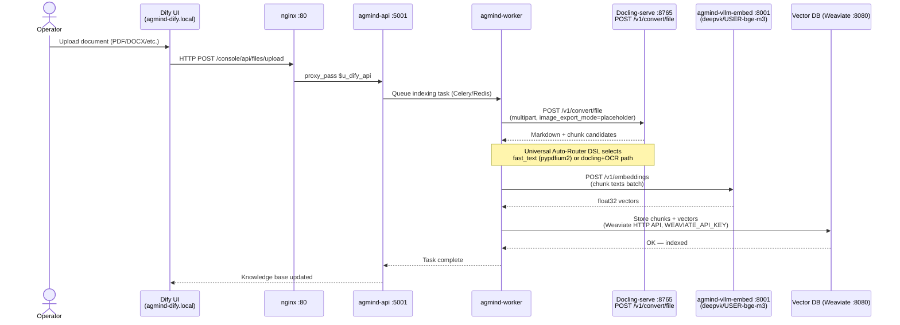
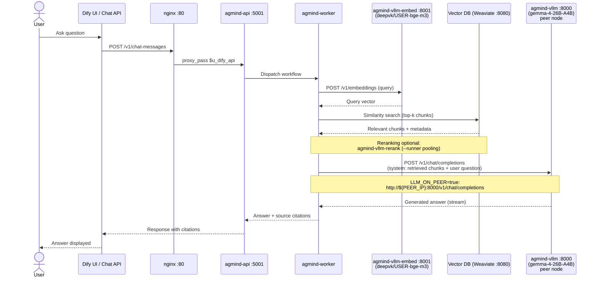

# Data Flow

Два основных потока данных в AGmind:

- **Flow A — Ingestion:** оператор загружает документ → документ преобразуется в чанки с эмбеддингами → попадает в векторную БД.
- **Flow B — Query:** пользователь задаёт вопрос → RAG-поиск по чанкам → LLM-генерация ответа.

Оба потока оркестрируются через Dify (Universal Auto-Router DSL, `templates/dify-workflows/`).
RAGFlow — альтернативный парсинг-тяжёлый путь ingestion при `ENABLE_RAGFLOW=true`;
подробнее: [`../dify-vs-ragflow.md`](../dify-vs-ragflow.md).

---

## Flow A — Ingestion (Document Upload)

> **Docling VLM picture description** (optional): при `do_picture_description=true`
> Docling-serve вызывает `DOCLING_VLM_URL` → vLLM `/v1/chat/completions` (peer-узел при `LLM_ON_PEER=true`)
> для аннотации изображений из документа (concurrency=8).

---

## Flow B — Query (RAG Question Answering)

> **LiteLLM gateway** (при `ENABLE_LITELLM=true`): между worker и vLLM может стоять
> `agmind-litellm :4000` как OpenAI-compatible proxy — позволяет подключать
> несколько LLM-бэкендов через единый endpoint.

---

See also: [topology.md](topology.md), [../dify-vs-ragflow.md](../dify-vs-ragflow.md), [../troubleshooting.md](../troubleshooting.md).
