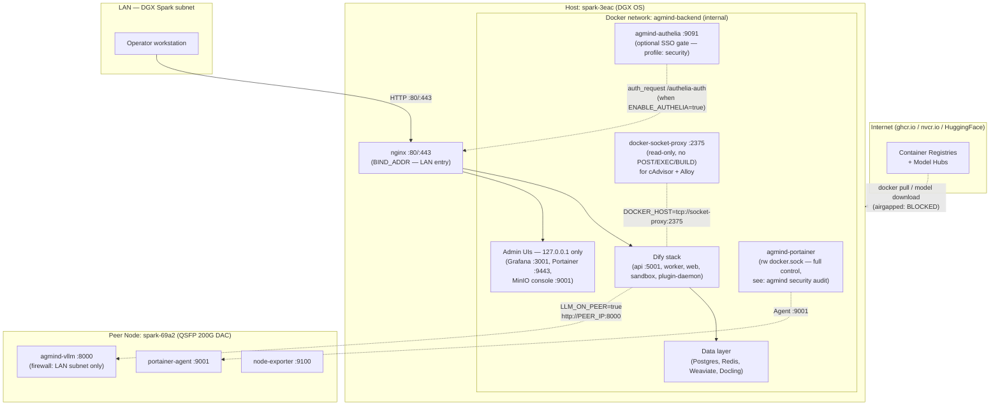

# Network & Security Zones

AGmind — LAN-only, single-tenant деплой (DGX Spark за NAT). Публичного ingress нет.
Единственная точка входа с LAN: nginx (`:80/:443`). Все admin-UI привязаны к
`127.0.0.1`/`${BIND_ADDR}` — доступны только с самого хоста (через SSH-туннель).

Архитектура хардинга описана в [`docs/security/hardening.md`](../security/hardening.md)
и [`docs/security/network-isolation.md`](../security/network-isolation.md).
ADR: [`../adr/0002-vps-profile-removed.md`](../adr/0002-vps-profile-removed.md) — почему
VPS/tunnel-путь удалён.

---

## Zone Diagram

---

## Port Binding Table

| Port | Service | Bind address | Reachable from |
|------|---------|-------------|----------------|
| `80` / `443` | nginx | `${BIND_ADDR}` (default: `0.0.0.0`) | LAN — all users |
| `8000` | peer vLLM | peer host NIC | LAN subnet only (iptables/ufw firewall on peer) |
| `3001` | Grafana | `127.0.0.1` | Host only (SSH tunnel) |
| `9443` | Portainer | `127.0.0.1` | Host only (SSH tunnel) |
| `9001` | MinIO console | `127.0.0.1` | Host only (SSH tunnel) |
| `9380` | RAGFlow admin | `127.0.0.1` | Host only |
| `5001` | Dify API | internal (`agmind-backend`) | Docker network only |
| `8080` | Weaviate | internal | Docker network only |
| `2375` | docker-socket-proxy | internal | Docker network only (read-only) |

Точные bind-адреса: `templates/docker-compose.yml`.
Аудит live-стека: `agmind security audit`.

---

## docker-socket-proxy (read-only mediation)

Вместо прямого монтирования `/var/run/docker.sock:ro` в каждый consumer-контейнер,
AGmind использует [Tecnativa docker-socket-proxy](https://github.com/Tecnativa/docker-socket-proxy):

- **Разрешено (read-only):** `CONTAINERS`, `INFO`, `EVENTS`, `IMAGES`, `NETWORKS`, `VOLUMES`, `PING`, `VERSION`
- **Запрещено:** `POST=0 EXEC=0 BUILD=0` — никаких мутирующих операций
- **Consumers через proxy:** cAdvisor, Grafana Alloy (метрики контейнеров)
- **Только Portainer имеет rw docker.sock** — ему нужен полный контроль; задокументировано в compose + отслеживается `agmind security audit`

---

## Airgapped Mode

При `AGMIND_AIRGAPPED=true`:

- `install.sh` не обращается к публичным registry/CDN — все образы должны быть загружены локально заранее
- `compose_pull` → no-op (проверка локальных образов)
- `airgapped_preflight` проверяет наличие всех `image:tag` из `templates/versions.env` через `docker image inspect` **до любых мутаций** — fails fast с точным списком отсутствующих
- Публичные DNS-запросы и apt-update пропускаются (`airgapped_guard`)
- mDNS (`.local`) остаётся — это LAN-протокол, не публичный

Офлайн-перенос: `agmind bundle create` создаёт tarball (образы + модели + repo),
`agmind bundle install` распаковывает на air-gapped боксе.
Подробнее: [`../installation/offline-install.md`](../installation/offline-install.md).

---

See also: [topology.md](topology.md), [data-flow.md](data-flow.md), [../security/](../security/), [../troubleshooting.md](../troubleshooting.md).
