# Service Topology

AGmind развёртывает ~48 Docker-контейнеров на DGX Spark (aarch64, Grace Blackwell GB10, 121 GiB unified memory).
Деплой — только LAN (DGX Spark за NAT, single-tenant). При `LLM_ON_PEER=true` вся LLM-нагрузка уходит
на второй Spark-узел (spark-69a2) через QSFP 200G DAC-линк.

Источник истины для версий образов: [`templates/versions.env`](../../templates/versions.env).
Диаграмма ниже показывает **структуру** (профили + связи), не версии.

```mermaid
graph TB
    subgraph peer["Peer Node — spark-69a2<br/>(LLM_ON_PEER=true)"]
        vllm["agmind-vllm :8000<br/>OpenAI-compat API<br/>(gemma-4-26B-A4B)"]
        vllm_embed["agmind-vllm-embed :8001<br/>(deepvk/USER-bge-m3)"]
    end

    subgraph master["Master Node — spark-3eac"]

        subgraph core["profile: core — Dify + Postgres + Redis + nginx + ssrf-proxy"]
            nginx["agmind-nginx :80/:443<br/>(LAN entry point)"]
            api["agmind-api :5001"]
            worker["agmind-worker"]
            web["agmind-web"]
            sandbox_pd["sandbox + plugin-daemon"]
            db["agmind-db (Postgres)"]
            redis["agmind-redis"]
            ssrf["agmind-ssrf-proxy (Squid)"]
        end

        subgraph rag["profile: rag — Weaviate + Docling + vLLM-embed"]
            weaviate["agmind-weaviate :8080"]
            docling["agmind-docling :8765<br/>POST /v1/convert/file"]
            litellm["agmind-litellm :4000"]
        end

        subgraph ragflow["profile: ragflow — RAGFlow + ES + MySQL + MinIO"]
            ragflow_svc["agmind-ragflow :9380"]
            ragflow_data["ES :9200 + MySQL :3306<br/>+ MinIO :9000"]
        end

        subgraph observability["profile: observability — Prometheus + Grafana + Loki + exporters"]
            grafana["agmind-grafana"]
            prometheus["agmind-prometheus + Alertmanager"]
            portainer["agmind-portainer :9443<br/>(127.0.0.1 only)"]
        end

        subgraph security["profile: security — Authelia + socket-proxy"]
            authelia["agmind-authelia :9091"]
            socket_proxy["agmind-docker-socket-proxy :2375<br/>(read-only, internal)"]
        end

        subgraph agents["profile: agents — Open WebUI + SearXNG + Crawl4AI + DB-GPT"]
            openwebui["agmind-open-webui :3000"]
            agents_rest["SearXNG + Crawl4AI + DB-GPT + Notebook"]
        end

    end

    nginx -->|"proxy_pass $var"| api
    nginx --> web
    nginx --> openwebui
    nginx --> litellm
    api --> db
    api --> redis
    api --> sandbox_pd
    worker --> db
    worker --> redis
    worker --> docling
    worker --> weaviate
    worker --> ssrf
    docling -.->|"VLM picture desc<br/>DOCLING_VLM_URL"| vllm
    worker -.->|"LLM_ON_PEER=true<br/>http://PEER_IP:8000"| vllm
    worker -.->|"embeddings"| vllm_embed
    api -.->|"LLM_ON_PEER=true"| vllm
    ragflow_svc --> ragflow_data
    prometheus -.->|"scrape peer :9100"| peer
    portainer -.->|"Agent :9001"| peer
    socket_proxy -.-|"ro docker.sock (cAdvisor/Alloy)"| prometheus
```

> **Note:** Qdrant (`--profile qdrant`) — альтернатива Weaviate; Milvus — EXPERIMENTAL, не входит ни в один
> named-профиль. Ollama скрыт из wizard-меню (default = vLLM, см. CLAUDE.md §6).
> Peer-узел работает только при `AGMIND_MODE=master` и содержит только: `agmind-vllm`, `node-exporter`, `portainer-agent`.

## Deployment Profiles

| Profile | Включает | Назначение |
|---------|----------|------------|
| `core` | Dify core + vLLM + LiteLLM | Минимальный — без RAG |
| `rag` | core + Weaviate + Docling + vLLM-embed | Рекомендуемый полный RAG-стек |
| `ragflow` | RAGFlow + Elasticsearch + MySQL + MinIO | Альтернативный парсинг-тяжёлый pipeline |
| `observability` | Prometheus + Grafana + Loki + экспортеры + Portainer | Мониторинг |
| `security` | Authelia + fail2ban/hardening | SSO + доп. хардинг |
| `agents` | LiteLLM + Crawl4AI + SearXNG + DB-GPT + Open WebUI + Notebook | Агентский инструментарий |
| `full` | Всё вышеперечисленное (один из каждой XOR-пары; без Milvus + Ollama) | Полная конфигурация |
| `dev` | core + observability (без RAGFlow/agents/security) | Быстрая итерация |

Посмотреть доступные профили и оценку ресурсов: `agmind profiles` / `agmind estimate`.

---

See also: [data-flow.md](data-flow.md), [security-zones.md](security-zones.md), [../compatibility-matrix.md](../compatibility-matrix.md).
